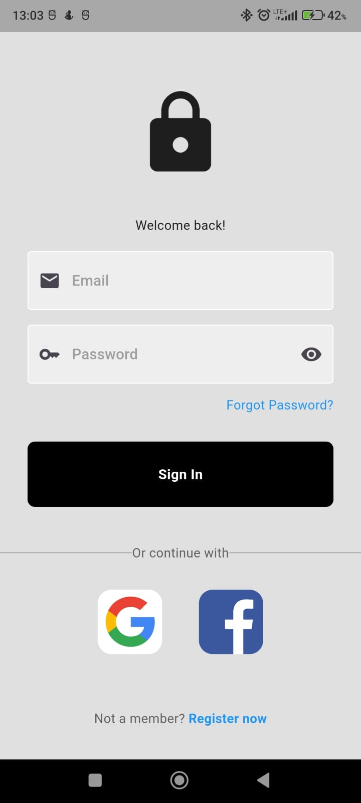
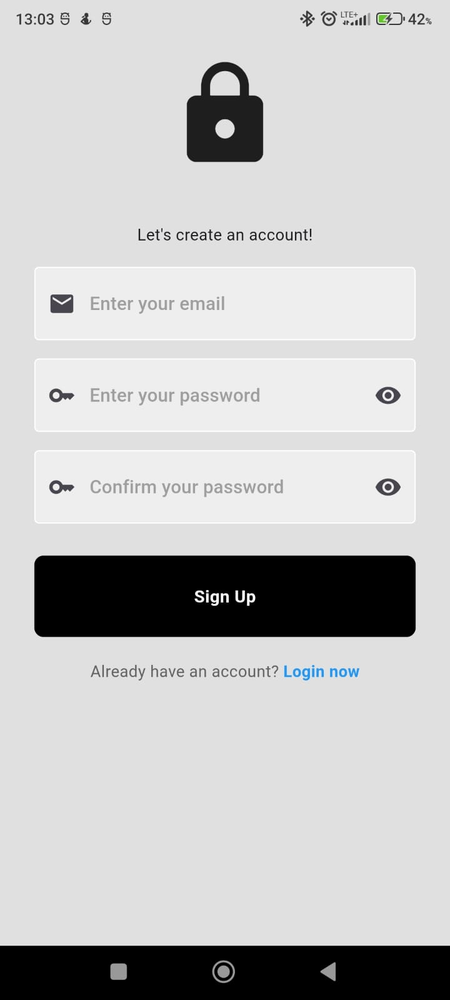
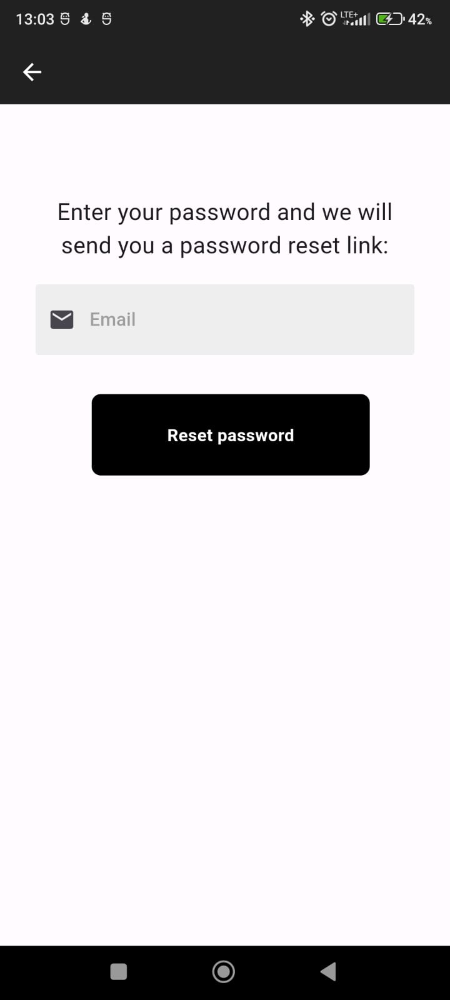

# Flutter Login App

An intuitive login flow built using Flutter. It includes email/password authentication, new user registration, password reset, and social logins with Facebook and Google. The app leverages Firebase for backend services, ensuring a seamless and secure user experience. With support for form validation, error handling, and responsive design, this app is a robust starting point for building authentication features in a Flutter application.

## Table of Contents

- [Features](#features)
- [Screenshots](#screenshots)
- [Getting Started](#getting-started)
  - [Prerequisites](#prerequisites)
  - [Installation](#installation)
  - [Running the App](#running-the-app)
- [Usage](#usage)
- [Firebase Configuration](#firebase-configuration)
- [Facebook Configuration](#facebook-configuration)
- [Built With](#built-with)

## Features

- Email and password authentication
- New user registration
- Password reset
- Login with Facebook and Google
- Firebase integration
- Form validation
- Error handling
- Responsive design

## Screenshots





## Getting Started

### Prerequisites

- Flutter SDK: [installation guide](https://flutter.dev/docs/get-started/install)
- Android Studio: [installation guide](https://developer.android.com/studio)
- Firebase account: [Firebase console](https://console.firebase.google.com/)
- Facebook Developer account: [Facebook for Developers](https://developers.facebook.com/)

### Installation

1. Clone the repository
   ```sh
   git clone https://github.com/dawid3056/login-app.git
   cd login-app

2. Install dependencies
    ```sh
    flutter pub get

### Running the App

1. Ensure you have an emulator or a physical device connected.

2. Run the app
    ```sh
    flutter run

## Usage 

After cloning the repository and installing the dependencies, you can start the app on your emulator or physical device. The app will open to a login screen where you can sign in with an email and password or create a new account. Use the menu to navigate through different features such as password reset. Optionally, login with Facebook or Google.

## Firebase Configuration

1. Set up Firebase for both Android and iOS. Follow the instructions provided in the [Firebase setup guide](https://firebase.flutter.dev/docs/overview/).

2. Add your Firebase project configuration to the app:
   - Download the `google-services.json` file for Android and place it in `android/app`.
   - Download the `GoogleService-Info.plist` file for iOS and place it in `ios/Runner`.

3. Create a `.env` file in the root of the project and add your Firebase keys:
   ```env
   WEB_API_KEY=your_web_api_key
   WEB_APP_ID=your_web_app_id
   MESSAGING_SENDER_ID=your_messaging_sender_id
   PROJECT_ID=your_project_id
   PROJECT_NAME=your_ios_project_name
   ANDROID_API_KEY=your_android_api_key
   IOS_API_KEY=your_ios_api_key
   ANDROID_APP_ID=your_android_app_id
   IOS_APP_ID=your_ios_app_id
   MACOS_APP_ID=your_macos_app_id

4. Add the `.env` file to your `.gitignore` to ensure it is not pushed to the repository.

## Facebook Configuration

1. Set up a new Facebook app in the [Facebook Developer Console](https://developers.facebook.com/).
2. Add your Facebook app ID to the project:

   - **For Android**:
     - Add the following to your `android/app/src/main/AndroidManifest.xml`:

       ```xml
       <meta-data android:name="com.facebook.sdk.ApplicationId" android:value="@string/facebook_app_id"/>
       ```
     - Create or update `android/app/src/main/res/values/strings.xml`:
       ```xml
       <resources>
         <string name="app_name">FACEBOOK_APP_NAME</string>
         <string name="facebook_app_id">FACEBOOK_APP_ID</string>
         <string name="fb_login_protocol_scheme">fbFACEBOOK_APP_ID</string>
         <string name="facebook_client_token">FACEBOOK_CLIENT_TOKEN</string>
       </resources>
       ```

   - **For iOS**:
     - Open `ios/Runner/Info.plist` and add:
       ```xml
       <key>CFBundleURLTypes</key>
       <array>
         <dict>
           <key>CFBundleURLSchemes</key>
           <array>
             <string>fbYOUR_FACEBOOK_APP_ID</string>
           </array>
         </dict>
       </array>
       <key>FacebookAppID</key>
       <string>YOUR_FACEBOOK_APP_ID</string>
       <key>FacebookDisplayName</key>
       <string>YOUR_APP_NAME</string>
       <key>LSApplicationQueriesSchemes</key>
       <array>
         <string>fbapi</string>
         <string>fb-messenger-api</string>
         <string>fbauth2</string>
         <string>fbshareextension</string>
       </array>
       ```


## Built With

- [Flutter](https://flutter.dev/) - The UI framework used to build the application.
- [Firebase](https://firebase.google.com/) - Backend services including authentication, database, and storage.


